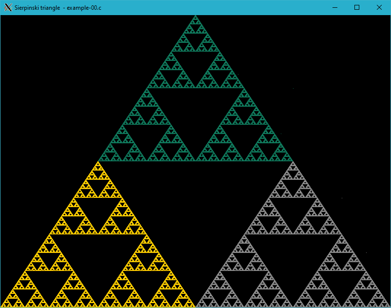

# Generating fractals

Any of various extremely irregular curves or shapes for which any suitably chosen part is similar in shape to a given larger or smaller part when magnified or reduced to the same size. This term was coined in 1975 to describe shapes that seem to exist at both the small-scale and large-scale levels in the same natural object. Fractals can be seen in snowflakes, in which the microscopic crystals that make up a flake look much like the flake itself. They can also be seen in tree bark and in broccoli buds. Coastlines often represent fractals as well, being highly uneven at both a large scale and a very small scale. Fractal geometry has been important in many fields, including astronomy, physical chemistry, and fluid mechanics. And even some artists are benefiting, creating beautiful and interesting abstract designs by means of fractals.

# Sierpinski triangle


/*
 * XWin library: Sierpinski triangle - example-00.c
 *
 * Copyright 2020-2021 Rafał Jopek ( rafaljopek at hotmail com )
 *
 * cc example-00.c ../../src/xwin.c -o example-00 -lX11 -lm
 *
 */

#include "../../src/xwin.h"

int main( int argc, char* argv[] )
{
   bool condition = true;
   int height = 0;
   int width = 0;
   int key;
   int y, x, color;
   unsigned int i;
   unsigned int y, x, x1, y1;

   XWinInit( argc, argv );

   XWinOpen( 800, 600, "Sierpinski triangle  - example-00.c" );

   while( condition )
   {
      if( height != WindowHeight() || width != WindowWidth() )
      {
         height = WindowHeight();
         width = WindowWidth();

         y1 = 0;
         x1 = width;

         for( i = 0; i < 1000000; i++ )
         {
            switch( RandomInt( 0, 2 ) )
            {
            case 0:
               y = ( y1 + 0 ) / 2;
               x = ( x1 + width / 2 ) / 2;
               color = 0x0f785b;
               break;
            case 1:
               y = ( y1 + height ) / 2;
               x = ( x1 + 0 ) / 2;
               color = 0xffcc00;
               break;
            case 2:
               y = ( y1 + height ) / 2;
               x = ( x1 + width ) / 2;
               color = 0x8a8a8a;
               break;
            }

            PutPixel( y, x, color );
            y1 = y;
            x1 = x;
         }
      }

      key = XWinInkey();

      switch( key )
      {
      case XK_Escape:
         condition = false;
         break;
      }
   }

   XWinClose();

   return 0;
}

#include "../../src/xwin.h"



---