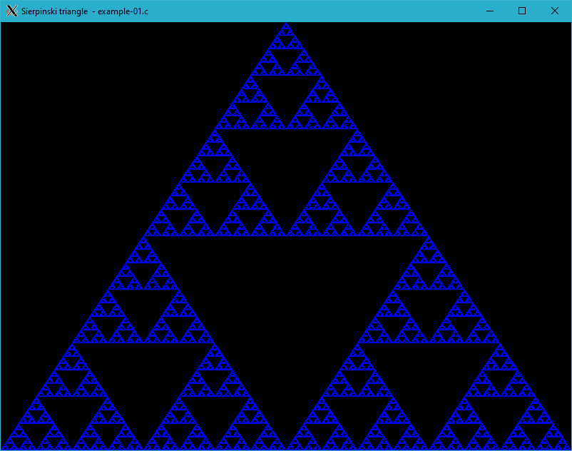

# Generating fractals

Iterated function system (IFS) fractals, as they are normally called, can be of any number of dimensions, but are commonly computed and drawn in 2D. The fractal is made up of the union of several copies of itself, each copy being transformed by a function hence "function system".

# Sierpinski triangle


/*
 * XWin library: Sierpinski triangle - example-01.c
 *
 * Copyright 2020-2021 Rafał Jopek ( rafaljopek at hotmail com )
 *
 * cc example-01.c ../../src/xwin.c -o example-01 -lX11 -lm
 *
 */

#include "../../src/xwin.h"

int main( int argc, char* argv[] )
{
   bool condition = true;
   int height = 0;
   int width = 0;
   int key;
   unsigned int i, n;
   double x, y;

   XWinInit( argc, argv );

   XWinOpen( 800, 600, "Sierpinski triangle  - example-01.c" );

   while( condition )
   {
      if( height != WindowHeight() || width != WindowWidth() )
      {
         height = WindowHeight();
         width = WindowWidth();

         y = 0;
         x = 0;

         n = Max( width, height );
         n = n * n / 3;

         for( i = 0; i < n; i++ )
         {
            switch( RandomInt( 0, 2 ) )
            {
            case 0:
               y = 0.5 * y;
               x = 0.5 * x + 0.25;
               break;
            case 1:
               y = 0.5 * y + 0.5;
               x = 0.5 * x;
               break;
            case 2:
               y = 0.5 * y + 0.5;
               x = 0.5 * x + 0.5;
               break;
            }

            PutPixel( ( int )( height * y ), ( int )( width * x ), 0x0000ff );
         }
      }

      key = XWinInkey();

      switch( key )
      {
      case XK_Escape:
         condition = false;
         break;
      }
   }

   XWinClose();

   return 0;
}



