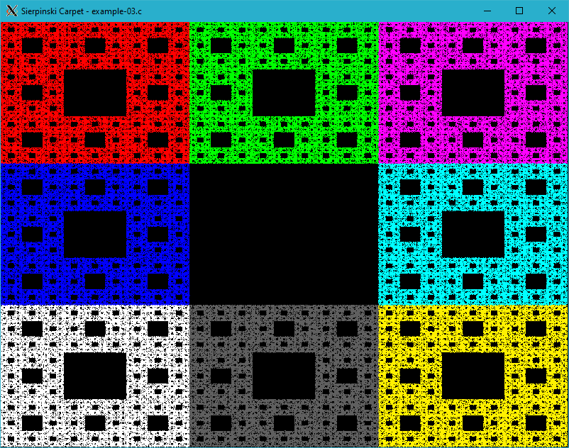

# Generating fractals

Iterated function system (IFS) fractals, as they are normally called, can be of any number of dimensions, but are commonly computed and drawn in 2D. The fractal is made up of the union of several copies of itself, each copy being transformed by a function hence "function system".

# Sierpinski Carpet


/*
 * XWin library: Sierpinski Carpet - example-03.c
 *
 * Copyright 2020-2021 Rafał Jopek ( rafaljopek at hotmail com )
 *
 * cc example-03.c ../../src/xwin.c -o example-03 -lX11 -lm
 *
 */

#include "../../src/xwin.h"

int main( int argc, char* argv[] )
{
   bool condition = true;
   int height = 0;
   int width = 0;
   int key;
   int color;
   unsigned int i, n;
   double x, y;

   XWinInit( argc, argv );

   XWinOpen( 800, 600, "Sierpinski Carpet - example-03.c" );

   while( condition )
   {
      if( height != WindowHeight() || width != WindowWidth() )
      {
         height = WindowHeight();
         width = WindowWidth();

         y = 0;
         x = 0;

         n = Max( width, height );
         n = n * n;

         for( i = 0; i < n; i++ )
         {
            switch( RandomInt( 0, 7 ) )
            {
            case 0:
               y = 0.333 * y;
               x = 0.333 * x;
               color = 0xff0000;
               break;
            case 1:
               y = 0.333 * y;
               x = 0.333 * x + 0.333;
               color = 0x00ff00;
               break;
            case 2:
               y = 0.333 * y;
               x = 0.333 * x + 0.666;
               color = 0xff00ff;
               break;
            case 3:
               y = 0.333 * y + 0.333;
               x = 0.333 * x;
               color = 0x0000ff;
               break;
            case 4:
               y = 0.333 * y + 0.333;
               x = 0.333 * x + 0.666;
               color = 0x00ffff;
               break;
            case 5:
               y = 0.333 * y + 0.666;
               x = 0.333 * x ;
               color = 0xffffff;
               break;
            case 6:
               y = 0.333 * y + 0.666;
               x = 0.333 * x + 0.333;
               color = 0x5f5f5f;
               break;
            case 7:
               y = 0.333 * y + 0.666;
               x = 0.333 * x + 0.666;
               color = 0xfff000;
               break;
            }

            PutPixel( ( int )( height * y ), ( int )( width * x ), color );
         }
      }

      key = XWinInkey();

      switch( key )
      {
      case XK_Escape:
         condition = false;
         break;
      }
   }

   XWinClose();

   return 0;
}



