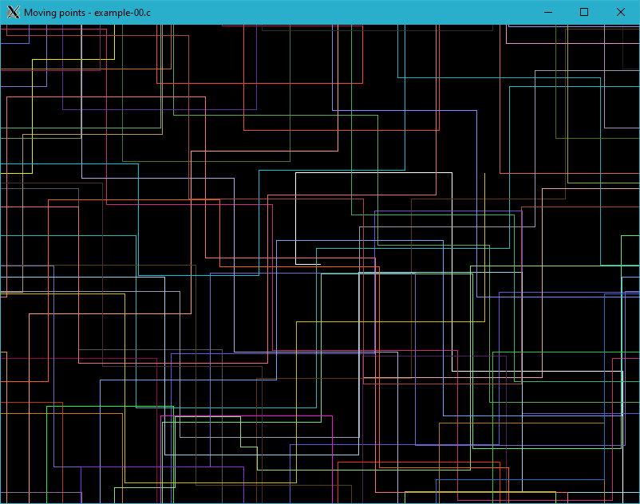

# example-00.c


/*
 * XWin library: Moving points - example-00.c
 *
 * Copyright 2020-2021 Rafał Jopek ( rafaljopek at hotmail com )
 *
 * gcc example-00.c xwin.c -o example-00 -lX11
 *
 */

#include "xwin.h"

int main( int argc, char* argv[] )
{
   bool condition = true;
   char udlr[ 4 ] = "udlr";
   char direction;
   int height = 0;
   int width = 0;
   int y, x, color = 0xffffff;
   unsigned long milliseconds = MilliSeconds();

   XWinInit( argc, argv );

   XWinOpen( 800, 600, "Moving points - example-00.c" );

   direction = udlr[ RandomInt( 0, 3 ) ];

   y = 300;
   x = 400;

   while( condition )
   {
      if( height != WindowHeight() || width != WindowWidth() )
      {
         height = WindowHeight();
         width = WindowWidth();
      }

      PutPixel( y, x, color );

      switch( direction )
      {
      case 'u':
         y = y < 0 ? height : y - 1;
         break;

      case 'l':
         x = x < 0 ? width : x - 1;
         break;

      case 'd':
         y = y > height ? - 1 : y + 1;
         break;

      case 'r':
         x = x > width ? -1 : x + 1;
         break;
      }

      if( MilliSeconds() - milliseconds > RandomInt( 100, 1000 ) )
      {
         switch( direction )
         {
         case 'u':
            direction = udlr[ RandomInt( 2, 3 ) ];
            break;

         case 'l':
            direction = udlr[ RandomInt( 0, 1 ) ];
            break;

         case 'd':
            direction = udlr[ RandomInt( 2, 3 ) ];
            break;

         case 'r':
            direction = udlr[ RandomInt( 0, 1 ) ];
            break;
         }

         milliseconds = MilliSeconds();
      }

      if( y < 0 || y > height || x < 0 || x > width )
      {
         color = rand() / ( ( RAND_MAX + 1u ) / 0xffffff );
      }
   }

   XWinClose();

   return 0;
}



