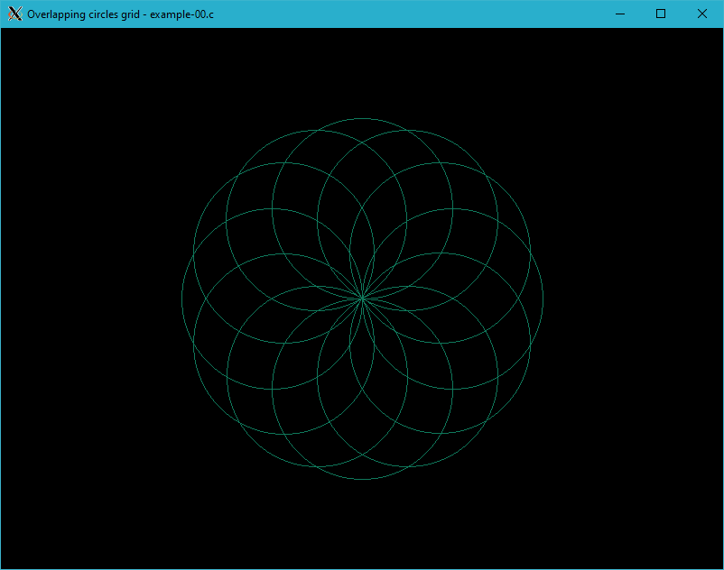

# example-00.c


/*
 * XWin library: Overlapping circles grid - example-00.c
 *
 * Copyright 2020-2021 Rafał Jopek ( rafaljopek at hotmail com )
 *
 * cc example-00.c ../../src/xwin.c -o example-00 -lX11 -lm
 * ./example-00 12
 *
 */

#include "../../src/xwin.h"

int main( int argc, char* argv[] )
{
   bool condition = true;
   int height = 0;
   int width = 0;
   int i, n;
   int y, x, radius = 100;
   int key;

   if ( argc < 2 )
   {
      n = 45;
   }
   else
   {
      n = atoi( argv[ 1 ] );
   }

   XWinInit( argc, argv );

   XWinOpen( 800, 600, "Overlapping circles grid - example-00.c" );

   while( condition )
   {
      if( height != WindowHeight() || width != WindowWidth() )
      {
         height = WindowHeight();
         width = WindowWidth();

         for( i = 0; i < n; i++ )
         {
            y = cos( M_PI + i * 2 * M_PI / n ) * radius + height / 2;
            x = sin(        i * 2 * M_PI / n ) * radius + width / 2;

            Circle( y, x, radius, 0x0f785b );
         }
      }

      key = XWinInkey();

      switch( key )
      {
      case XK_Escape:
         condition = false;
         break;
      }
   }

   XWinClose();

   return 0;
}



