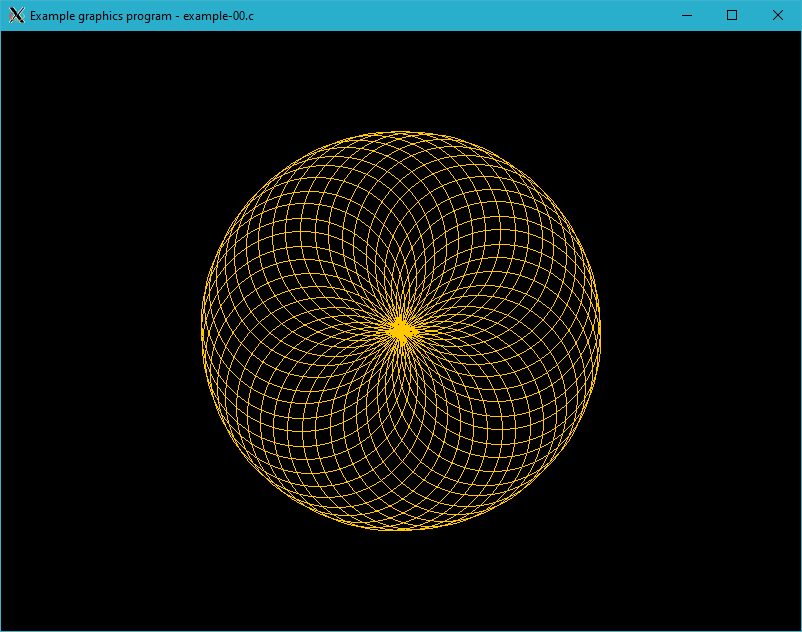

# XWin

**XWin** is a module providing bindings for the [libX11](https://www.x.org/ ) graphics library. This tutorial is intended for people who want to start to program with the libX11 library. Keep in mind that libX11, isn't what most programmers wanting to write graphic applications are looking for. They should use a much higher level GUI toolkit like [GTK](https://www.gtk.org/), [Motif](https://motif.ics.com/) etc. However, we need to start somewhere. More than this, knowing how things work down below is never a bad idea. The project has an educational nature the main goal is to expand knowledge in the field of creating the aplications with the usege of library libX11 and C language.

## Example code


/*
 * cc example-00.c ../../src/xwin.c -o example-00 -lX11 -lm
 *
 */

#include "../../src/xwin.h"

int main( int argc, char* argv[] )
{
   bool condition = true;
   int height = 0;
   int width = 0;
   int i, n = 45;
   int y, x, radius = 100;
   int key;

   XWinInit( argc, argv );

   XWinOpen( 800, 600, "Overlapping circles grid - example-00.c" );

   while( condition )
   {
      if( height != WindowHeight() || width != WindowWidth() )
      {
         height = WindowHeight();
         width  = WindowWidth();

         for( i = 0; i < n ; i++ )
         {
            y = cos( M_PI + i * 2 * M_PI / n ) * radius + height / 2;
            x = sin(        i * 2 * M_PI / n ) * radius + width / 2;

            Circle( y, x, radius, 0x0f785b );
         }
      }

      key = XWinInkey();

      switch( key )
      {
      case XK_Escape:
         condition = false;
         break;
      }
   }

   XWinClose();

   return 0;
}



> [License MIT](LICENSE.html) &copy; 2020-2021 Rafał Jopek
